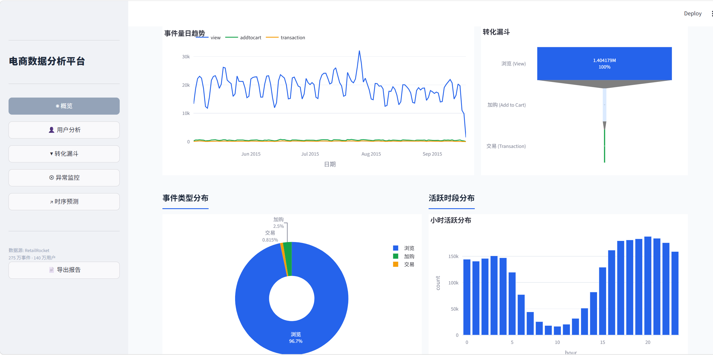
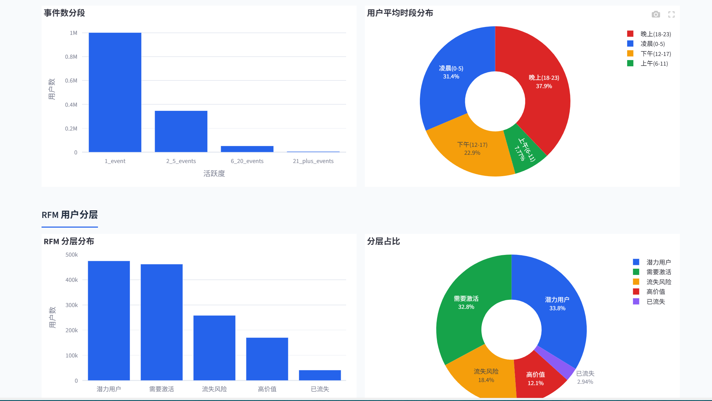
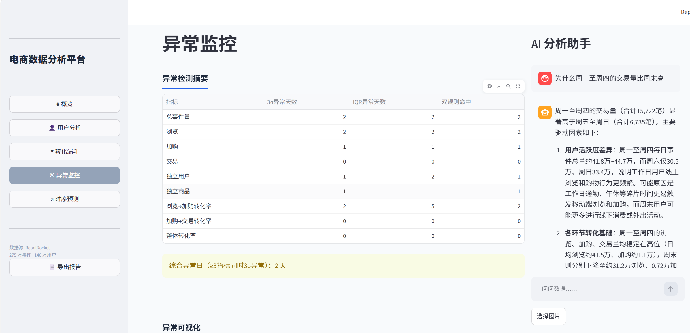
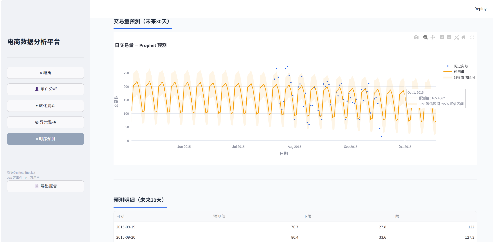

# ecommerce-analyzer

端到端电商数据分析平台 — 基于 Kaggle RetailRocket 140 万条用户行为数据，集成 AI Agent 智能分析引擎，支持自然语言对话式深度分析与 Prophet 时序预测。

<!-- SCREENSHOT: 概览页仪表盘全貌（KPI卡片 + 日趋势图 + 事件分布饼图），展示平台主界面 -->


---

## 核心能力

### 看板与可视化

| 页面 | 内容 |
|------|------|
| 概览 | 核心 KPI 卡片、日趋势图、事件类型分布、同比环比 |
| 用户分析 | 用户画像分布（时段/活跃度/设备）、RFM 分层（8 象限） |
| 转化漏斗 | 浏览→加购→交易 各环节转化率、分 weekday 对比 |
| 异常监控 | 三层检测（3σ / IQR / Prophet 残差）、异常日明细表 + 原因标注 |
| 时序预测 | Prophet 30 天交易量预测、置信区间、模型评估指标（MAE/RMSE/MAPE） |

<!-- SCREENSHOT: 用户分析页（用户画像 + RFM 分层图表并排） -->


<!-- SCREENSHOT: 异常监控页（Prophet拟合对比图 + 残差异常日明细表） -->


### AI 智能分析

- **自然语言对话**：侧边栏 AI 聊天抽屉，用中文提问即可获得数据分析报告，Agent 自动感知当前所在页面并提供贴合上下文的回答
- **多模态图表识别**：上传看板截图或数据图表，Agent 调用智谱 GLM-4V 视觉模型识别图中数据，实现跨来源对比分析
- **自动图表生成**：Agent 根据分析结果自动调用 Plotly 生成可视化图表，直接嵌入对话
- **深度上下文追问**：支持 "为什么"、"拆解到 XX 维度" 等连续追问，Agent 保留对话记忆，可跨页面上下文下钻
- **一键导出**：任意分析结果生成 Markdown 报告，含完整数据表与图表

<!-- SCREENSHOT: AI对话界面（展示一次完整分析问答，"为什么周一至周四的交易量比周末高" → Agent返回含图表的多段分析报告） -->


### 异常检测三层架构

```
第一层：统计规则  → 3σ + IQR 独立检测，多指标按日交叉统计
第二层：时序残差  → Prophet 拟合历史趋势，残差 > 3σ 标记异常
第三层：综合判定  → 按日汇总三层标记，标注异常原因
```

<!-- SCREENSHOT: 时序预测页（Prophet预测图，含历史拟合线 + 未来30天预测 + 置信区间阴影） -->


---

## 系统架构

```
┌─────────────────────────────────────────────────────┐
│                   Streamlit 看板                      │
│  ┌──────────┬──────────┬──────────┬────────────────┐ │
│  │  概览页   │ 用户分析  │ 漏斗分析  │ 异常监控 │ 预测  │ │
│  └──────────┴──────────┴──────────┴────────────────┘ │
│              ┌──────────────────────┐                 │
│              │   AI 聊天抽屉（侧边栏）│                 │
│              └──────────────────────┘                 │
├─────────────────────────────────────────────────────┤
│                    AI 智能层                           │
│  ┌─────────┐ ┌──────────┐ ┌──────────┐ ┌───────────┐ │
│  │ nl2sql  │ │query_tools│ │chart_read│ │  Agent    │ │
│  │ 自然查询 │ │KPI/下钻/漏斗│ │智谱GLM-4V│ │ ReAct调度 │ │
│  └─────────┘ └──────────┘ └──────────┘ └───────────┘ │
├─────────────────────────────────────────────────────┤
│                    分析引擎                            │
│  ┌──────────┐ ┌────────┐ ┌──────────┐ ┌──────────┐ │
│  │ 用户画像  │ │转化漏斗 │ │ 留存分析  │ │ RFM分层  │ │
│  └──────────┘ └────────┘ └──────────┘ └──────────┘ │
│  ┌──────────┐ ┌────────────────────────────┐         │
│  │ 异常检测  │ │ Prophet 时序预测            │         │
│  └──────────┘ └────────────────────────────┘         │
├─────────────────────────────────────────────────────┤
│                   数据管道                             │
│  ┌──────────┐ ┌────────┐ ┌──────────┐ ┌──────────┐ │
│  │ 原始加载  │→│ 清洗   │→│ 质量校验  │→│ 特征工程  │ │
│  └──────────┘ └────────┘ └──────────┘ └──────────┘ │
│              ┌──────────┐                             │
│              │ SQLite缓存│（加载后持久化）              │
│              └──────────┘                             │
└─────────────────────────────────────────────────────┘
```

---

## 数据流水线

```
RetailRocket 原始 CSV
    │ 275 万行原始事件
    ▼
load_raw.py        → 加载 3 个 CSV，自动推断 schema
    │
    ▼
clean.py           → 去重、去异常时间戳、统一类型、生成衍生特征
    │ 140 万行清洗后数据
    ▼
validate.py        → 空值率、事件分布、时间范围 → 生成质检报告
    │
    ▼
preprocess.py      → 日聚合、用户-商品特征矩阵、转化率计算
    │
    ▼
cache.py           → 写入 SQLite（daily 表、KPI 快照、预测结果缓存）
    │
    ▼
Streamlit 看板 ← 启动时从 SQLite 加载，无需重复跑 pipeline
```

---

## AI Agent 交互示例

```
用户：为什么周一至周四的交易量比周末高？

Agent（感知到当前在概览页）：
  ├─ 读取 daily 表，按 weekday 聚合交易量
  ├─ 生成 weekday 对比柱状图
  ├─ 分析工作日 vs 周末的用户行为差异
  └─ 输出分析报告 + 图表："工作日交易量均值为 420 笔/天，周末仅 260 笔/天，
      可能原因：工作日浏览-加购-交易完整路径占比更高"

用户：把异常日那几天的详细数据列出来

Agent（继承上文 + 切换到异常监控上下文）：
  ├─ 从 anomaly_detect 读取异常日列表
  ├─ 拉取异常日的 KPI、漏斗、事件分布明细
  └─ 输出汇总表，标注每项指标偏离程度

用户：预测一下接下来30天的交易趋势

Agent：
  ├─ 调用 Prophet 预测引擎
  ├─ 输出未来 30 天预测图表（含置信区间）
  └─ 附带模型评估指标（MAE / RMSE / MAPE）

用户：导出这份分析报告

Agent：
  └─ 生成 Markdown 报告 → output/report_xxx.md（含全部 8 个章节）
```

---

## 开发路线

| 阶段 | 内容 | 状态 |
|------|------|:--:|
| P0 | 项目骨架：目录结构、配置、BaseDataSource 抽象基类 | ✓ |
| P1 | 数据管道：加载/清洗/校验/特征工程 + SQLite 缓存 | ✓ |
| P2 | 探索分析：用户画像、转化漏斗、留存、RFM、异常检测 | ✓ |
| P3 | 看板：Streamlit 5 页面 + AI 聊天抽屉 + 报告导出 | ✓ |
| P4 | AI 核心层：ReAct Agent、nl2sql、query_tools | ✓ |
| P5 | 预测增强：Prophet 时序预测 + chart_reader（智谱 GLM-4V 多模态识别） | ✓ |

详细交付记录见 [`output.md`](output.md)，完整方案文档见 [`ecommerce-analyzer-方案.md`](ecommerce-analyzer-方案.md)。

---

## 快速开始

### 环境要求

- Python 3.10+
- DeepSeek API Key（[注册获取](https://platform.deepseek.com/)）— 文本推理
- 智谱 API Key（[注册获取](https://open.bigmodel.cn/)）— 图表识别（可选，不配置则 chart_reader 不可用）

### 安装与运行

```bash
git clone https://github.com/jjyc050706/ecommerce-analyzer.git
cd ecommerce-analyzer
pip install -r requirements.txt
```

配置 API Key（二选一或全配）：

```bash
# 方式一：环境变量
export DEEPSEEK_API_KEY=sk-xxx
export ZHIPU_API_KEY=xxx

# 方式二：编辑 config.py
# DEEPSEEK_API_KEY = "sk-xxx"
# ZHIPU_API_KEY = "xxx"
```

启动：

```bash
streamlit run dashboard/app.py
```

> 数据集较大（~120MB），首次启动会自动加载并缓存到 SQLite，后续启动秒开。

---

## 项目结构

```
ecommerce-analyzer/
├── config.py                      # 全局配置
├── requirements.txt
├── .streamlit/
│   └── config.toml                # Streamlit 主题
│
├── data/                          # 数据集（需从 Kaggle 下载）
├── data_pipeline/                 # 数据清洗流水线
│   ├── base_source.py             #   BaseDataSource 抽象基类
│   ├── load_raw.py                #   加载原始 CSV
│   ├── clean.py                   #   清洗 + 去重
│   ├── validate.py                #   质量校验报告
│   ├── preprocess.py              #   特征工程
│   └── cache.py                   #   SQLite 缓存层
│
├── eda/                           # 探索性分析
│   ├── user_profile.py            #   用户画像
│   ├── behavior_funnel.py         #   转化漏斗
│   ├── retention.py               #   留存分析
│   ├── rfm_analysis.py            #   RFM 分层
│   ├── anomaly_detect.py          #   三层异常检测
│   └── forecaster.py              #   Prophet 预测器
│
├── dashboard/                     # Streamlit 看板
│   ├── app.py                     #   主入口
│   ├── pages/                     #   5 个分析页面
│   └── components/                #   图表/聊天/样式/导出/持久化
│
├── ai_layer/                      # AI 智能层
│   ├── agent.py                   #   混合模式 Agent（ReAct + nl2sql）
│   ├── llm_client.py              #   LLM API 封装（DeepSeek + 智谱 GLM-4V）
│   ├── prompts.py                 #   Prompt 模板（快照注入约束）
│   └── tools/                     #   nl2sql / query_tools / chart_reader
│
├── screenshots/                   # 截图（你需要补充）
├── ecommerce-analyzer-方案.md      # 完整方案文档
└── output.md                      # 开发交付记录
```

---

## 技术栈

| 层 | 选型 |
|----|------|
| AI 模型 | DeepSeek（文本推理 + nl2sql）+ 智谱 GLM-4V（图表识别） |
| Web 框架 | Streamlit |
| 数据处理 | Pandas + SQLite |
| 可视化 | Plotly（交互优先） |
| 时序预测 | Facebook Prophet |
| 持久化 | SQLite（对话历史 + 分析产物） |

---

## 数据集

[Kaggle RetailRocket E-commerce Dataset](https://www.kaggle.com/datasets/retailrocket/ecommerce-dataset) — 137 天用户行为记录，含浏览 / 加购 / 交易三类事件，覆盖 140 万条事件、31 万独立商品。

需从 Kaggle 手动下载 3 个 CSV 文件放入 `data/` 目录。

---

## 许可证

MIT
*（内容由AI生成，仅供参考）*
